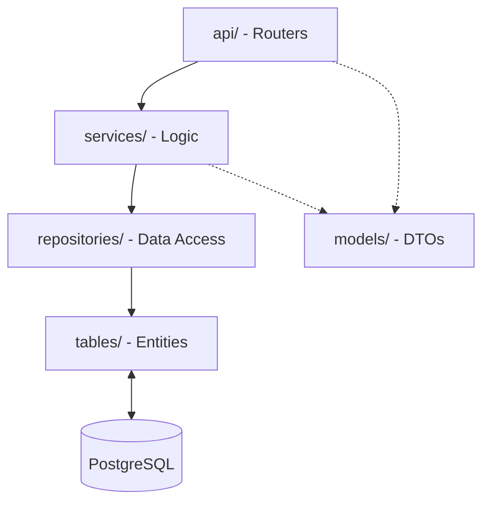

# FastAPI Scalable Backend Boilerplate

This boilerplate provides a highly maintainable, production-ready structure for FastAPI applications. It enforces a clean separation of concerns using a pragmatic 3-tier architecture while providing built-in tools for both ORM and optimized raw SQL performance.

## 🏗 Architecture & Layers

This project follows a strict **Layered Architecture** to ensure maintainability and testability:



### Module Responsibilities
- **`app/api/` (Presentation)**: HTTP routing, request parsing, and response formatting.
  - `dependencies.py`: FastAPI Dependency Injection (get_db, current_user, etc).
  - `decorators.py`: Advanced auth/rate-limiting wrappers.
- **`app/services/` (Business Logic)**: Orchestrates repositories and contains core domain workflows. Decoupled from HTTP objects.
- **`app/repositories/` (Data Access)**: Abstraction over database operations. Shields services from SQLAlchemy details.
- **`app/models/` (Data Transfer Objects)**: Pydantic v2 schemas for API validation and serialization. Suffixed with `Dto`.
- **`app/tables/` (Database Entities)**: SQLAlchemy Declarative models mapped to relational tables. Suffixed with `Table`.
- **`app/core/` (Infrastructure)**: Cross-cutting concerns—database connection, security (JWT), exceptions, and generic SQL helpers.

---

## 🛠 Features

### 1. Database Agnostic Core
The system defaults to **PostgreSQL** but remains fully compatible with MySQL or SQLite via SQLAlchemy. It uses the `pg8000` driver for efficient, pure-python communication.

### 2. High-Performance Testing
The testing suite leverages **Testcontainers** to spin up real PostgreSQL instances automatically:
- **Zero Pollution**: Every test run starts with a clean database.
- **Blazing Fast**: Uses a **Transaction Rollback** pattern. Tables are created once per session, and every individual test is rolled back upon completion, ensuring 100% independence in milliseconds.
- **Mocks Included**: Pre-configured `unittest.mock` examples for external services (like Email/S3).

### 3. Visual & Developer Experience
- **VS Code Ready**: Comprehensive `.vscode/settings.json` and `pytest.ini` ensure tests are discoverable and run immediately from the IDE.
- **Lifespan Management**: Database initialization is handled via FastAPI `lifespan`, preventing connection errors during background test discovery.
- **Rate Limiting**: Built-in `SlowAPI` integration with guest-cookie support.

---

## 🚀 Quick Start

### 1. Environment Setup
```powershell
python -m venv .venv
.\.venv\Scripts\activate
pip install -r requirements.txt
```

### 2. Secrets Management
Copy `.env.example` to `.env` and configure your database credentials.

### 3. Run Development Server
```powershell
# With auto-reload
$env:PYTHONPATH='.'; uvicorn app.main:app --reload
```

### 4. Execute Tests
```powershell
# Run full suite (Automatically handles PostgreSQL Docker container)
$env:PYTHONPATH='.'; pytest tests/
```

### 5. Running with Docker
```powershell
docker compose up -d --build
```

---

## 🤝 Module Dependencies Summary

| Module | Level | Dependencies | Upstream Caller |
| :--- | :--- | :--- | :--- |
| **Routers** | Presentation | `Service`, `Models`, `Core` | `FastAPI` (HTTP Request) |
| **Services** | Business | `Repository`, `Models`, `Core` | `Routers` |
| **Repositories** | Data Access | `Tables`, `Core` | `Services` |
| **Tables** | Entities | `SQLAlchemy` | `Repositories`, `Services` |
| **Models** | DTOs | `Pydantic` | `Routers`, `Services` |
| **Core** | Infrastructure | `SQLAlchemy`, `Passlib`, `JWT` | All Layers |

---

## 🧑‍💻 Coding Conventions
- **Naming**: Database classes end in `Table`, Pydantic classes end in `Dto`.
- **Injection**: Always use FastAPI `Depends()` for services and repositories.
- **Exceptions**: Raise `CustomHTTPException` (from `app.core.exceptions`) in any layer; the middleware converts them to JSON responses automatically.
